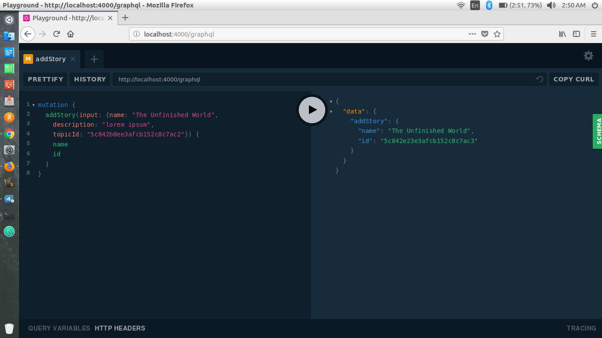
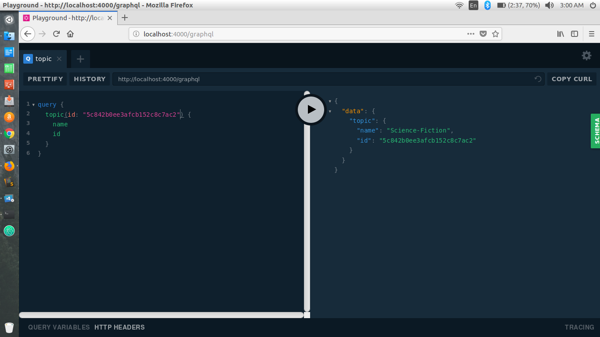
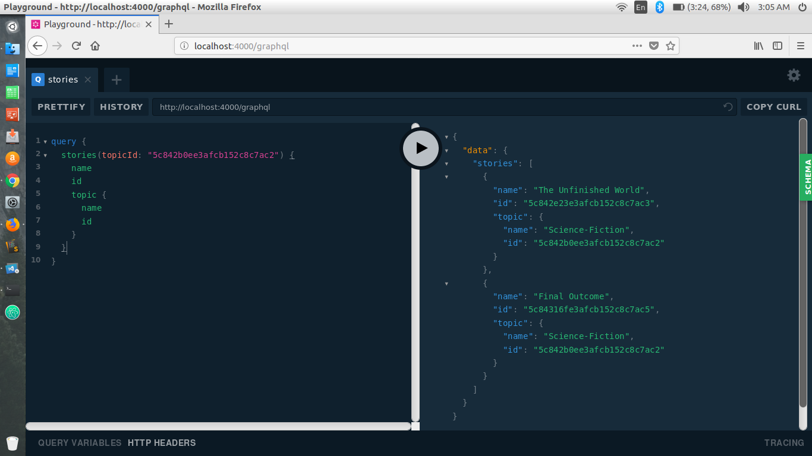
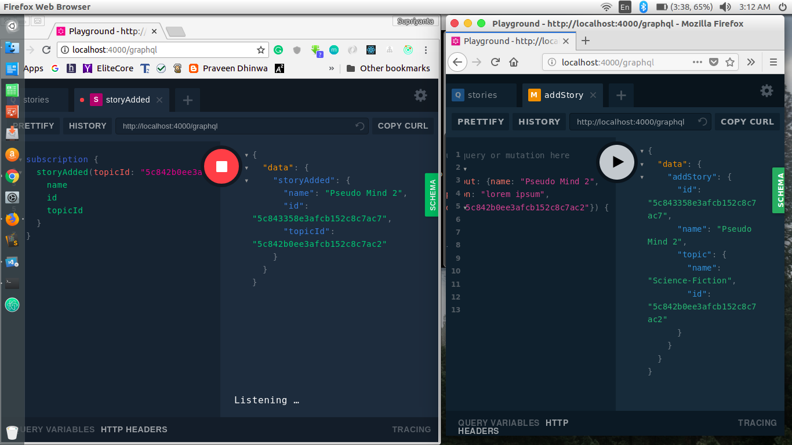

# GBlog
>A backend implementation of a blog app where you can get realtime updates from story of a particular topic when someone publishes a new story.

# User Guide

### How to Setup

Clone the repository.

`git clone https://github.com/supriyanta/GBlog.git`

Change directry to the folder.

`cd GBlog/`

And run npm install to install the dependencies.

```
 npm install
```

Change the MongoDB url to user local mongodb database url in *GBlog/keys.js*.

example:
```javascript
module.exports = {
    mongodbUrl: "mongodb://localhost/gblog"
}
```

### How to Use

Start the mongodb server in your local machine

`sudo service mongod start`

Open the terminal.

start the npm server 

`npm start`

And use [http://localhost:4000/graphql](http://localhost:4000/graphql) and the graphql playground will open up.

#### Mutation

##### addTopic:

A Topic should have the following parameters.

| Params        | Type          | Description  |
| ------------- |:-------------:| :-----:|
| name      | *String* | Name of the Topic |

In the playground type the following to create a topic...


##### addStory:

A Story should have the following parameters.

| Params        | Type          | Description  |
| ------------- |:-------------:| :-----:|
| name      | *String* | Name of the Story |
| description  | *String* | Description of the Story |
| topicId      | *ID* | id of the Topic under which the story will publish |

In the playground type the following to create a story...



#### Query

##### topic:

To query a Topic, it should have the following parameters.

| Params        | Type          | Description  |
| ------------- |:-------------:| :-----:|
| id      | *ID* | id of the Topic |

In the playground type the following to query a topic...



#### stories:

To query all the Stories of a particular Topic, it should have the following parameters.

| Params        | Type          | Description  |
| ------------- |:-------------:| :-----:|
| topicId      | *ID* | id of the Topic |

In the playground type the following to query the stories...



#### Subscription

##### storyAdded:

To subscribe a Topic, it should have the following parameters.

| Params        | Type          | Description  |
| ------------- |:-------------:| :-----:|
| topicId      | *ID* | id of the Topic |

Open two browser window and type the following to subscribe a topic and get the realtime update someone publish a story...

