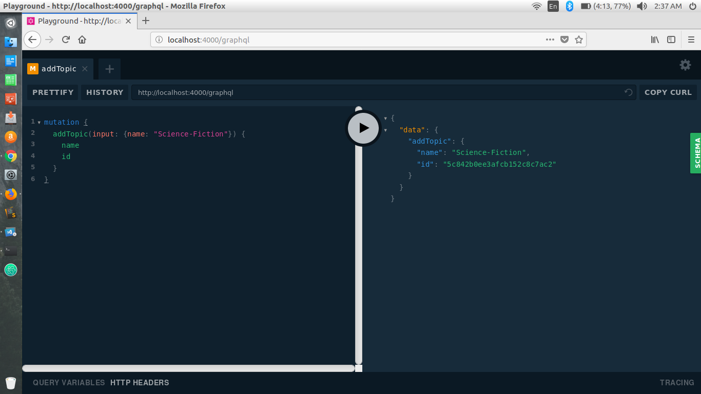

# GBlog
>A backend implementation of a blog app where you can get real-time updates from story of a particular topic when someone publishes a new story.

# User Guide

### How to Setup

Clone the repository.

`git clone https://github.com/supriyanta/GBlog.git`

Change directry to the folder.

`cd GBlog/`

And run npm install to install the dependencies.

```
 npm install
```

Change the MongoDB url to user local mongodb database url in *GBlog/keys.js*.

example:
```javascript
module.exports = {
        mongoURI: "mongodb://localhost:27017/admin"
}
```

### How to Use

Start the mongodb server in your local machine

`sudo service mongod start`

Open the terminal.

start the npm server 

`npm start`

And use [http://localhost:4000/graphql](http://localhost:4000/graphql) and the graphql playground will open up.

#### Mutation

###### addTopic
    A topic should have the following parameters.

    | Params        | Type          | Description  |
    | ------------- |:-------------:| :-----:|
    | name      | *String* | Name of the topic |

In the playground type the following to create a topic...


